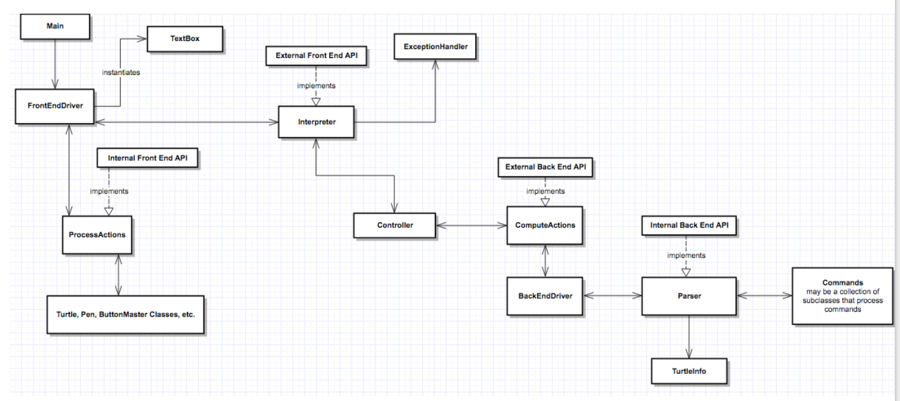
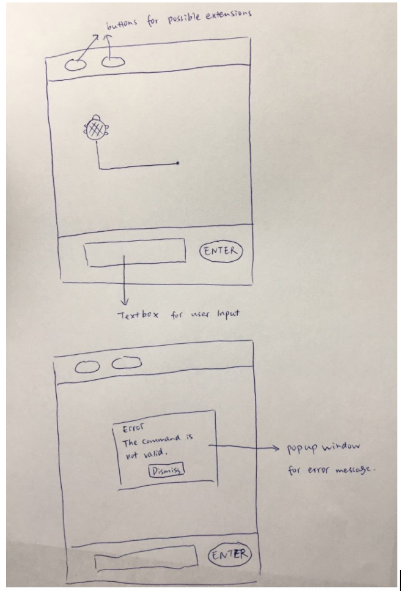

### Introduction 

Our team will create a program to run simple Logo (SLogo).  This program is meant to increase understanding of code by simulating movement, mathematical operations, and other actions using an appealing GUI with a turtle object.  The primary design goals of this project are to create a flexible interpreter to parse information that the user inputs in the UI and use that to perform actions to visualize or display on the UI.  User inputs will be handled to change the scene or alter the state of the turtle, update a scene with updated turtle positions, and throw necessary exceptions when the user inputs malformatted commands into the textbox. 

The most flexible part of the project will be the interpreter because it has to be able to handle a large number of different commands, nested commands, different ordering styles, and different command languages.  The front end and back end will be fairly encapsulated and will only pass information that is absolutely needed for operation on the opposite end.  At a basic level, the front end will create a UI and pass commands to the back end, which will parse these commands, throw exceptions back to the front end if necessary, and perform the logic needed to ultimately pass actions to perform back to the front end.  The interaction between the back end and front end will be facilitated by APIs to uphold good design.

At a high level, the controller will send user text input from the front end driver to the back end driver, and the controller will also be responsible for sending the resulting commands from the interpreter’s backend driver to the frontend (view) driver. There will be 4 APIs--one that handles the external front end public methods, one that handles the internal front end public methods, one that handles the external back end methods, and one that handles the internal back end public methods. This controller will send input based on how the user interacts with the program and will be managed by the front end. 

### Design Overview

On a high level, the SLogo design plan is to have a front end, back end, and two layers of hierarchy separating their communication.  The front end contains the Main, FrontEndDriver, TextBox, ProcessActions (implementation of the internal front end API), and several helper classes such as Turtle, Pen, and ButtonMaster.  The FrontEndDriver passes all required back end information to the Interpreter, which is the implementation of the external front end API.  The Interpreter passes information such as the user instructions to the ComputeActions class, which is an implementation of the external back end interface.  The ComputeActions class then triggers back end work by calling BackEndDriver.  

The back end consists of the BackEndDriver, Parser, TurtleInfo, and Commands classes.  The Commands class may be broken down into several helper and abstract classes as explained in a later section.  The BackEndDriver ultimately returns a new TurtleInfo object, which contains information about turtle updates (displacement).  BackEndDriver returns this new object to ComputeActions, and ComputeActions passes this information back up to Controller.  Controller sits at the top of the program hierarchy.  Controller finally passes the interpreted instruction (in the form of a TurtleInfo object) to the FrontEndDriver.  Using this update information, FrontEndDriver calls ProcessActions in order to display the new changes on the UI.

With a basic implementation, the two levels of hierarchy, with ComputeActions and the Interpreter passing information back and forth from Controller, is not actually necessary since passing information is a passive role.  However, these two levels of hierarchy will become useful once the front end and back end become more complex.

As mentioned above, the four APIs are as follows:
* Front End API implementations: ProcessActions and Interpreter
* Back End API implementations: ComputeActions and Parser

ProcessActions is the internal API implementation and receives information about updates to the UI and to the turtle from the FrontEndDriver, and then uses this information to determine how to update the UI.  FrontEndDriver will trigger ProcessActions by calling processUpdates(TurtleInfo T).  Then, for example, if the dx and/or the dy entries of the TurtleInfo object are not 0, then ProcessActions will use a method moveTurtle(dx, dy).  There are similar other methods in this interface implementation that perform actions in this manner.

Interpreter, the external API implementation, will serve to pass String user instructions to the Controller from the FrontEndDriver and subsequently to the back end, and will also pass TurtleInfo objects to the FrontEndDriver.  FrontEndDriver will trigger Interpreter by calling setRawInput(String user_instruction).  Controller will use getRawInput to obtain the instruction and pass it to the back end.

In the back end, ComputeActions is the external API implementation, and the Controller triggers it by calling setParseText(String text).  Then, the BackEndDriver accesses that information through getTextToParse().  Once the instruction logic is implemented, the Controller accesses updates by calling getInfoUpdates(), which returns the new TurtleInfo object.

Parser is the internal back end API implementation.  It is triggered by BackEndDriver using getCommands() and processCommands(String[] commands).  Parser uses the Commands class to operate on information given and then returns a new TurtleInfo object to the BackEndDriver.  

### User Interface 

The user will interact with our program through a textbox. The textbox will be a class in our design. There will also be a button called ‘Enter’. The button will have an EventHandler so that whenever the button is pressed by the user, the text inside the textbox will be obtained and other actions will be triggered. If data input is not valid, an error message will pop up to alert the user. For future extension, more buttons can be created when the user cannot interact through a command. This is easy as we only need to add the new button to the scene. Specifically, the design will look like:

 

### API Details 
#### Front-end
* There will be two APIs for the front-end/model--one external that controls the flow of information from the front-end to the controller, and one internal that controls the flow of information within the front end (ie, to and from the driver class). 

* The external front end API will have the following methods: setRawInput(), getRawInput() and getCommand(). The getRawInput() method will be used by the controller to get the String of the input commands that the user enters into the textbox, which will be passed through the controller to the back end interpreter. Then, the controller will receive the command from the back end interpreter, and the Model driver will call getCommand() to get that command from the controller. This could be extended to include other information that the user would have to pass on to the interpreter by including new information into the driver.

* The internal front end API will control the interaction between the front end driver class and the other classes within the front end package(s). These will include at least a Turtle class, a Pen class, a Textbox class, an Error_message class, and a Buttonmaster class. The driver class will change the configuration of the scene/turtle according to the commands run. The driver class will be responsible for setting up the scene and responding to when the user clicks the button indicating that he/she would like a command to be run. These commands will be the results of the back end interpreter. In that case, an event handler located in the driver class would be activated. Once the information from the interpreter is received, it can be broken up and fed to each appropriate command from by each class. For example, the internal api will include a protected moveturtle(distance) function so that the driver class can call it. It will also have turnTurtle(), faceTurtle(), changePenColor(), setTurtleVisibility(), changePenShape(), changeTurtleImage(), and clearText() functions. 

* The front end will be responsible for throwing any exceptions occurring in the back end interpreter. An exception class will be created and called from the external API since it involves a communication between the backend and frontend to show a pop up and require the user to take appropriate action. 

#### Back-end
* Classes: (also described in the API document)
    * Driver: communicates between the parts of the backend and is where most of the internal api calls are made, calls the parser first to parse the inputText, then works with the returned list by using reflection to determine which method to call in the Command class. This is done by working from the last command in the list (the innermost function) and the first values in the list taking as many parameters as needed. This will also have to get rid of finished functions and replace initial values with returned values and get rid of extra spaces of values that have been used (shifting other values up). This will also have to convert the value strings into integers/doubles that can be manipulated. This loops through the double list and catches any errors/exception handling. Finally it generates the new TurtleInfo after the commands have been executed.
    * Parser: parses the String inputText from the frontend 
    * TurtleInfo: contains instance variables for all of the potential commands. Doubles dx, dy, dr are all the displacement changes in the x position, y position, and rotation respectively. These get rid of the need to keep track of the absolute x, y, and r values in the backend (when they are inherently in the frontend). There are absX, absY, and absR are for when the absolute values for those parameters x, y, and r are changed. This will also need to get more values from the frontend (absolute degrees currently pointing and current position). pendown and visible are booleans. clear will also be a boolean that can be edited set by the frontend back to 0 after the screen has been changed
    * Command: defines all of the methods for each command. Reflection will determine which method is actually run by linking the string of the command to the actual method.

* Back-end API
    * There are two APIs that will be used for the backend. This includes an external API that helps facilitate the information transfer from the backend to the front end and an internal API that helps facilitate information transfer within the backend. Note that most of the calls to the external API will be done in the Controller, and most of the calls to the internal API will be done in the BackendDriver, which directs and facilitates the actions performed in the back end and is called by the Controller.

    * The external API will be made up of the following methods:
        * setParseText(String inputText)  //to set the text that is inputted from the frontend to be parsed

        * getInfoUpdates()  
            //to get the changes in the turtle information from the backend to the frontend where it will graphically changed 
            //returns the TurtleInfo displacements 
Since this returns the TurtleInfo object it is very easy to extend this when more parameters must be changed visually based on instructions. Another instance variable just needs to be created in the TurtleInfo class to reflect this and then the frontend just needs to access that and process that accordingly.

        * getErrorsText()  //to get the text that is set whenever an error occurs in the backend (from incorrect number of parameters/typo in command/missing spaces/etc)
 //returns the String that has the error message

    * The internal API will be made up of the following methods:

        * getCommands(String inputText)  //to set the text that is inputted from the frontend to be parsed
 //returns the String split into an array (String[]) of the commands and values in order they appear in the inputText

        * parseCommands(String[] commands)  //iterates through the commands and for each command, accesses the map that connects commands to how many parameters it needs, and uses reflection to call that method

         * /* ***THE COMMAND METHODS*** */  
//These will most likely be separated into their own API from the general internal api, especially when more commands are implemented 
//these could also be split into similar groups of methods such as state changes and turtle physical movements (which would require a Command abstract class and subclasses with StateChangeCommand and MovementCommand.   These subclasses would enable better encapsulation and ensure that each class is tackling only one specific thing such as only movements or only state changes.

        * Forward(double pixels)  //runs by using reflection on the parsed commands
 //returns a TurtleInfo object with all 0.0s except the dx as the pixels parameter
 //very similar for Back, Left, Right

        * SetHeading(double degrees)  //returns a TurtleInfo object with all 0.0s except the absR as the degrees parameter

### API Example Code 
* Hide the turtle 
The textbox receives the command, and uses its getText() method to pass the information on to the controller, which receives it via its getRawInputView() method. The controller then passes this command on to the interpreter, which accesses it via its getRawInputModel() command. Then, the interpreter outputs the command as an array of all things updated, which the controller accesses through the getCommand() method. The interpreter also stores this command via storeCommand() in its internal API. The front end driver successfully receives this information via the getCommand() method apart of the external Model API. Once it is received, all pieces of the command are separated and each possible characteristic of the turtle is updated with its command. Of course, all other aspects of the turtle will remain the same since they will be passed 0 or “false” to not change. The setTurtleVisibility() method will be called, which will be a part of the Model Internal API, to not display the actual imageview of the turtle. 
* Turn the turtle 45 degrees and move forward 15 units 
	The process for interpreting the command is processed in a similar way to the previous example. The difference with this use case is what data the system gains and where it distributes. The command array that the front end driver receives will call moveTurtle(15) and turnTurtle(45), which will update those parameters in the turtle object and be updated in the scene automatically. These calls will still occur in the button event handler. 
* Show Error Message 
When instance variable of Command inside Front end driver class shows invalid, An error message window should be popped up. This is done inside Front end driver class. Use an if condition to check whether Command[0] is equal to “invalid”, if so, create an instance of Error Message Class object. The parameter of the Error Message Object should be get from Command[1], which indicates the specific error. Then a method in Front end driver class called ErrorMessagePopUp() will be called to create the popup window.
* Draw dotted line 
When instance variable of Command shows changing pen to draw dotted line, a new instance of DottedLinePen object will be created(sub class of Pen super class). Then it will add the new object to the scene and remove the old pen object. The new object has the same location as the previous one.  
* Missing parameters 
When the parsing has started, a map will be created that matches the words in a specific language selected to the words that correspond to the methods in english. Within this map, we were also going to include the number of parameters (doubles) that are needed for execution. So then, if there are missing parameters then the code will break. We will then have to throw a missingParameterError and pass the string corresponding with that error to the frontend for displaying.
* Excess parameters 
Technically the code should run if there are excess parameters and will just do nothing with the extra ones. OR we could implement the code so that it only runs if there are the correct number of parameters. Either way we will need to check for the number of parameters before running the code or after (to see if any are left over), and throw an excessParameterError and pass the string corresponding with that to the frontend for displaying.
* Handle instruction “fd 50”  
This means move the turtle up by 50 pixels. Within Parser, this instruction will be mapped to the moveForward(double num) method in the Commands class.  moveForward(50) will then create a new TurtleInfo object that has its x displacement value changed to 50, while all other values are 0 or “false.” Then, this TurtleInfo object would be returned to the Parser, which will pass it to the BackEndDriver.
* Handle instruction “fd sum 45 45” 
After BackEndDriver passes this instruction to the Parser, the Parser will go through the String backwards, first starting at the two 45s and the sum, using reflection to map sum to the sum method, and then add the two 45s.  Then, the Parser parsing method will store the 90 and then essentially compute actions for “fd 90” as described above.

### Design Considerations 
This section describes any issues which need to be addressed or resolved before attempting to devise a complete design solution. Include any design decisions that the group discussed at length (include pros and cons from all sides of the discussion) as well as any ambiguities, assumptions, or dependencies regarding the program that impact the overall design.

One issue that we discussed extensively is that where we should put the EventHandler method for buttons. When the “enter” button is pressed, there should be an EventHandler to actually change the turtle. This requires change of scene. If the EventHandler is put inside Button Class, it would be hard to change the scene because the stage is in the Front end driver class. So we decide to put the EventHandler method inside Front end driver class. It makes much sense but it also has the disadvantage of making the Front end driver class longer. 

Another design consideration we had was determining whether information should be duplicated in the frontend and backend. The turtle location and parameters are held closely to the frontend for visualization, so having them in the backend seemed redundant. Also then there would need to be more information in the external APIs to transfer this information and then the getters and setters would also have to be encapsulated. We decided that this seemed unnecessary and that we could just keep the absolute values and parameters in the frontend where graphical display actually happens and generate all of the differences/changes in the backend through reading the instructions

### Team Responsibilities 
* Archana - Backend, PRIMARY coding instructions, SECONDARY helping with parsing the text from the front end
* Kelly - Backend, PRIMARY parsing text from the front end, SECONDARY helping code instructions
* Owen - Frontend, PRIMARY setting up the stage, images, observers and eventhandlers for all state changes, SECONDARY helping with the controller and movement logic 
* YiQin - Frontend, PRIMARY setting up the movement logic (mostly math) using the displacement values passed from the backend, SECONDARY helping with the controller and the display logic

### PLAN
We plan to have the basic structure of the frontend and backend fleshed out by next Wednesday/Thursday the 18th/19th. For the frontend, this constitutes the display of the turtle, textbox and other buttons/interactions, and being able to interpret what the backend sends to the front end through external apis. For the backend, this constitutes being able to parse all of the instructions that are passed from the front end to the backend through external apis. Then being able to interpret said instruction and pass the updated info to the frontend.

Then for the next days until the basic implementation is due, we will connect the frontend and backend, creating the Driver and Controller classes and also debug where needed. We will also work on refactoring our code to get rid of redundancies, clarify variable and method names, and make our code more efficient.  Also increasing polymorphism would be nice and adding more abstraction, making the next sprint easier.  We will also take some time to reflect and speculate what the next sprint could consist of.  Then we will face the next sprint confidently and plan accordingly. We will probably keep similar subgroups for backend and frontend, but that could also change, so we will see!
